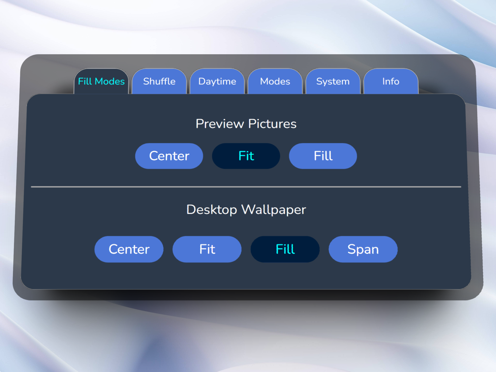
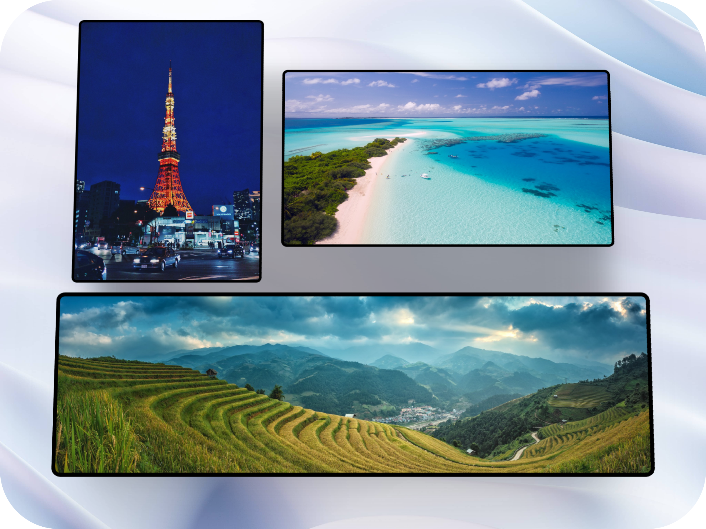
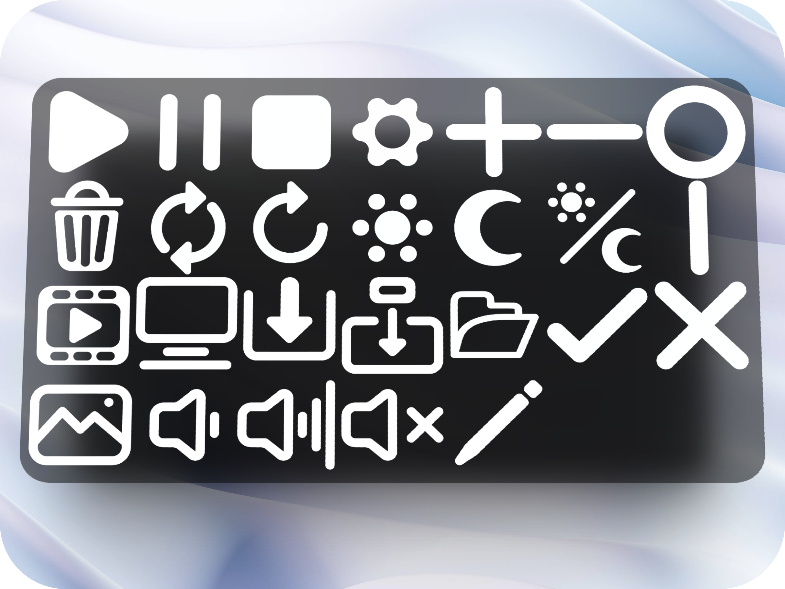
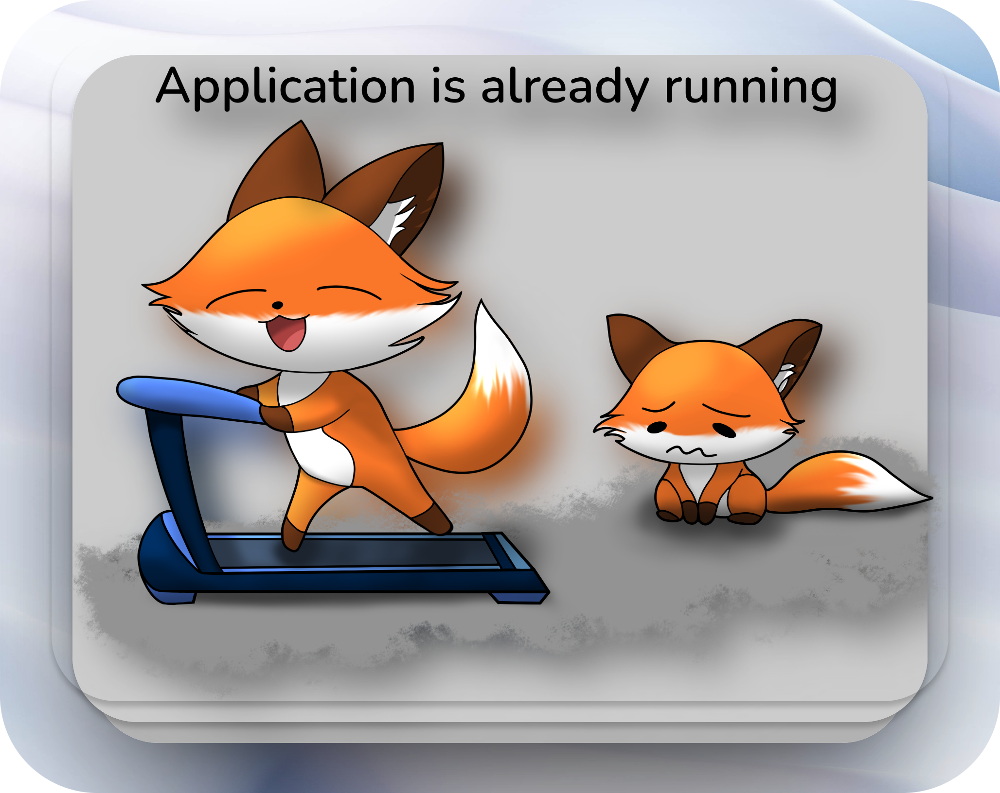
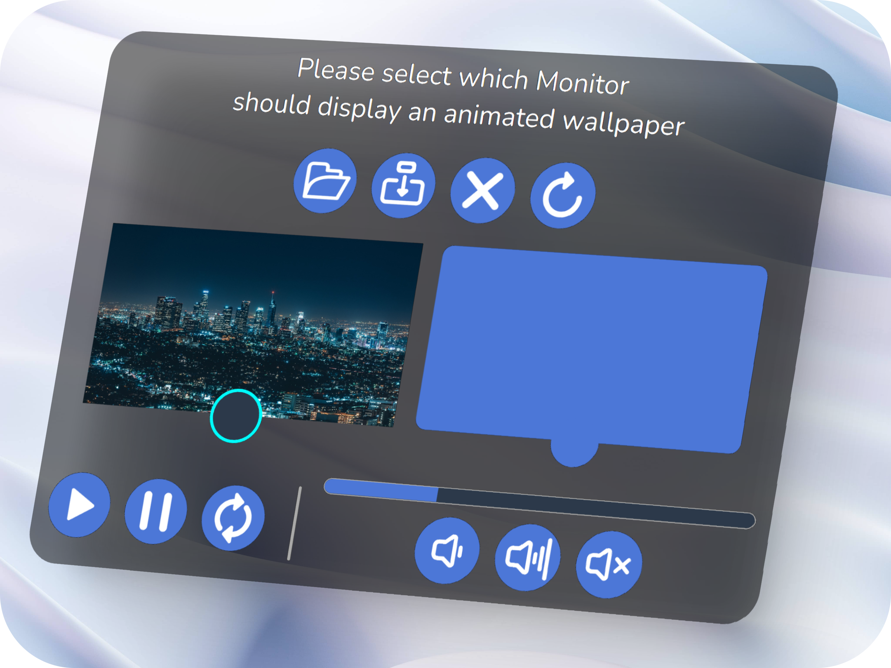

# Desktop Fox - Desktop Wallpaper Manager for Windows

Desktop Fox ist ein Hintergrundbildmanager für Windows. Er bietet die Möglichkeit feinerer Einstellungen an den bekannten Windows Funktionen durchzuführen und enthält darüber    hinaus noch eine Vielzahl von zusätzlichen Funktionen.

* Ändern der Bildkollektionen bei Tag/Nacht-Wechsel
* Erweiterte Funktionalität der Windows Hintergrundbilder
* Support für bis zu 3 Monitoren mit unterschiedlichen Kollektionen
* Bewegte Hintergrundbilder ***(Experimentell)***
     

## Tageszeitenwechsel

Passe die Hintergründe der Tageszeit an und lasse dir wunderschöne Landschaften am Tag und ruhige Nachtaufnahmen von Städten oder einem funkelnden Sternenhimmel in der Nacht anzeigen.  
       
    

## Erweiterte Einstellungsmöglichkeiten

Zu den bekannten Funktionen, die Windows für die Hintergrundbilder bereitstellt, gibt es auch noch viele weitere Einstellungsmöglichkeiten.
* Tageszeit-Wechsel
* Feinere Einstellungsmöglichkeiten für die Intervall-Zeit des Bildwechsels
* Unterschiedliche Kollektionen für bis zu 3 Monitore
       
   

## Multimonitor Support

Eine Kollektion zu wenig? 
Vielleicht verwendest du mehrere Monitore, aber nicht alle sind im Landscape-Format aufgestellt. 
Es können bis zu 3 Monitore mit separaten Kollektionen konfiguriert werden.  
Hiermit ist es möglich, Bilder mit speziellen Formaten auf dem richtigen Monitor anzeigen zu lassen.
      
   

## Custom Icons

Alle Icons der Applikation wurden selbst erstellt, um der Benutzeroberfläche einen eigenen Touch zu geben. 
Durch sie soll ein weicher, abgerundeter Eindruck erzeugt werden.  
Außerdem erhöht es die Barrierefreiheit durch leicht verständliche Symbolik für die wichtigsten Funktionen.
Sowie handgezeichnete Bilder zur Veranschaulichung von Fehlermeldungen.

      
    

## Handdrawn Errors

Das Benutzen einer App sollte Spaß machen, selbst wenn unerwartete Dinge passieren. 
Zur Auflockerung wurden deshalb handgezeichnete Bilder verwendet.

      
     

## Bewegte Hintergrundbilder

Sind dir einfache Bilder zu langweilig? 
Reicht es dir nicht nur jede Minute ein neues Bild zu sehen? 
 
Mit bewegten Hintergründen kannst du deinem Desktophintergrund endlich Leben einhauchen und Videos mit Audio verwenden.
Es können alle gängigen Videoformate verwendet werden wie bspw.: mp4, mkv, webm, avi, flv, mov, mkv 
       
   

# Credits
* Author - Andreas Keimel
* 9eck0 for the Windows IDesktopWallpaper API  https://github.com/9eck0/IDesktopWallpaper-dotNet
* The VLC Team for the LibVLCSharp Lib  https://code.videolan.org/videolan/LibVLCSharp
> Aufgrund der [Lizenz von VLCSharpLib](https://videolabs.io/solutions/libvlcsharp/), enthält dieses Git-Projekt keine Kompilierte Version des Programms.  
> Due to the [licenses of VLCSharpLib](https://videolabs.io/solutions/libvlcsharp/), this Git project does not include a compiled version of the program.

# Tools
* Visual Studio 
* GitHub
* Clip Studio Paint
