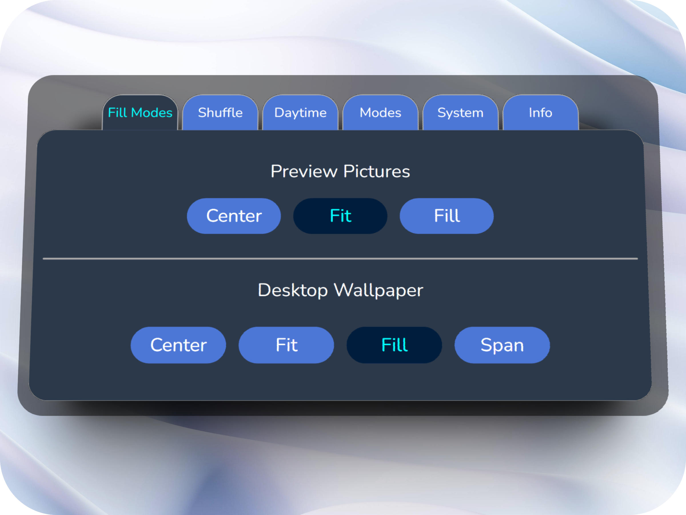

# Desktop Fox
<kbd></kbd>
Desktop Wallpaper Manager for Windows

Desktop Fox ist ein Hintergrundmanager für Windows.
Er bietet die möglichkeit feinerer Einstellungen an den bekannten Windows funktionen durchzuführen
und enthält darüber hinaus noch eine Vielzahl von zusätzlichen Funktionen.

* Ändern der Bildkollectionen bei Tag/Nacht Wechsel
* Erweiterte Funktionalität der Windows Hintergrundbilder
* Support für bis zu 3 Monitoren mit Unterschiedlichen Kollektionen
* Bewegte Hintergrundbilder ***(Experimentel)***

<kbd></kbd>

## Tageszeitenwechsel
**Passe die Hintergründe der Tageszeit an**

Lass dir wunderschöne Landschaften und Strände am Tag und ruhige Nachtaufnahmen von Städten oder einem funkelnden Sternenhimmel in der Nacht anzeigen.
  

<kbd></kbd>

## Einstellungsmöglichkeiten
Zu den bekannten Funktionen die Windows für die Hintergrundbilder bereitstellt, gibt es auch noch viele weitere Einstellungsmöglichkeiten.
* Tageszeit Wechsel
* Feinere Einstellungsmöglichkeiten für die Intervallzeit des Bildwechsels
* Unterschiedliche Kollektionen für bis zu 3 Monitore

<kbd></kbd>

## Multimonitor Support

## Custom Icons
Alle Icons der Applikation wurden von mir selbst gezeichnet, um der Benutzeroberfläche einen eigenen Touch zu geben.

<kbd></kbd>

## Bewegte Hintergrundbilder
Sind dir einfache Bilder zu langweilig. Reicht es dir nicht nur jede Minute ein neues Bild zu sehen.
Mit Bewegten Hintergründen kannst du deinem Desktophintergrund Leben einhauchen und Videos mit Audio verwenden.
Es können alle gängigen Videoformate verwendet werden wie bspw.: mp4, mkv, webm, avi, flv, mov, mkv 

<kbd></kbd>
